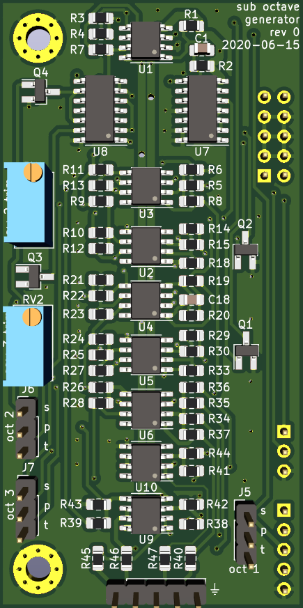
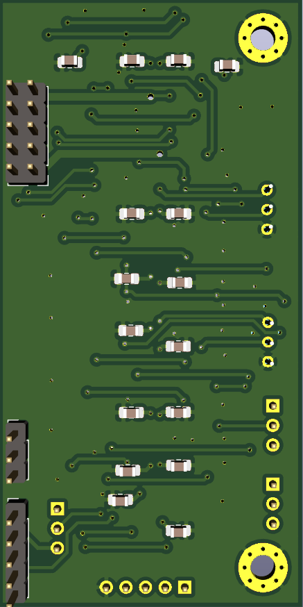

# Sub-Oscillator auxilliary waveshaper

Small aux waveshaper pcb intended to be used with the oscillator carrier boards.

Contains two sub-oscillator circuits cascaded in series, for -1 octave and -2 octaves. Triangle, sawtooth, and variable width pulse waves are available for all octaves.

 