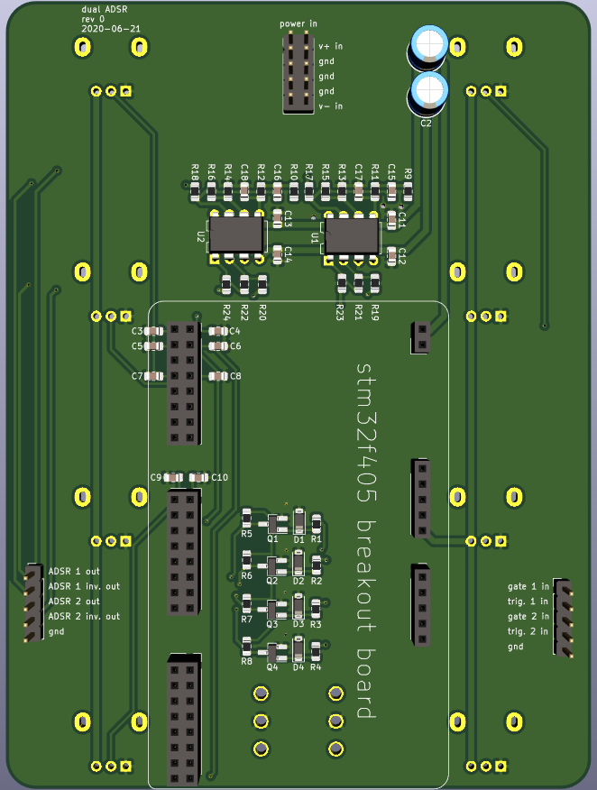
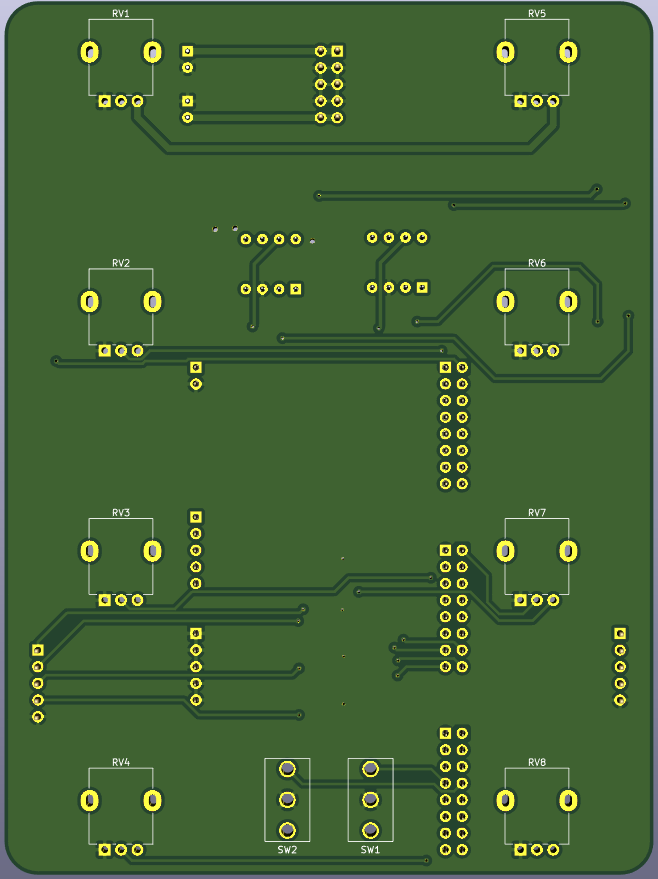

# Dual ADSR carrier board

ADSR motherboard with port for stm32 breakout board and two opamp low-pass filters.

The ADSRs are generated digitally on the stm32 breakout board, and filtered and amplified on this board.
 
  