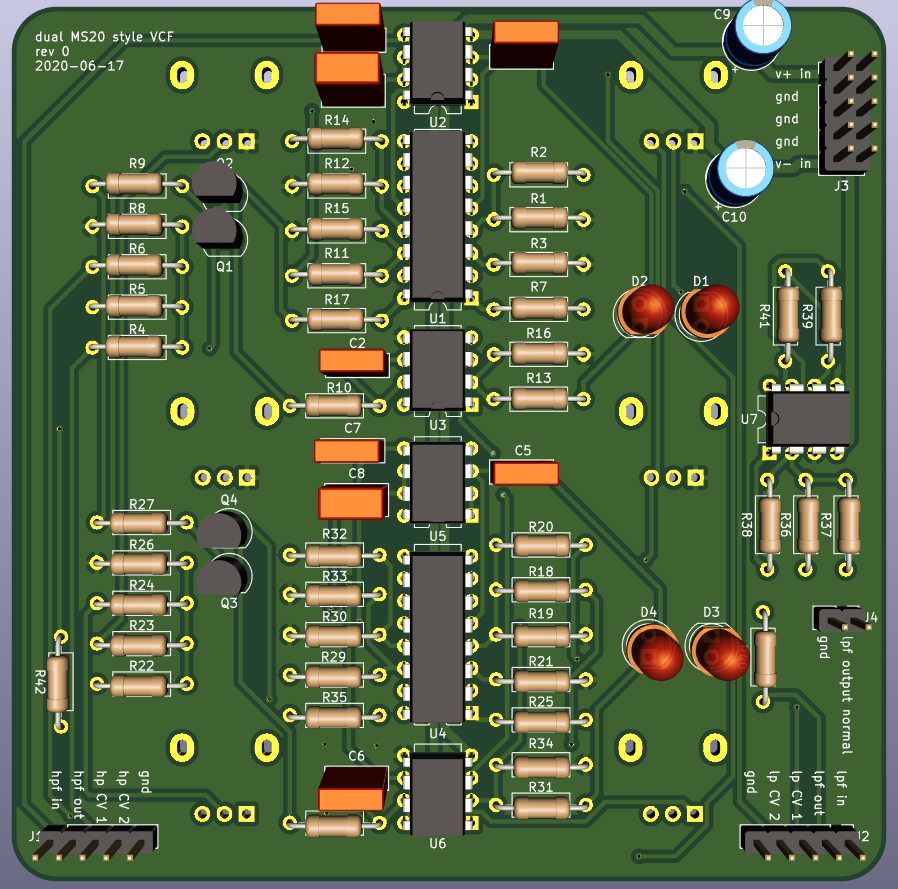
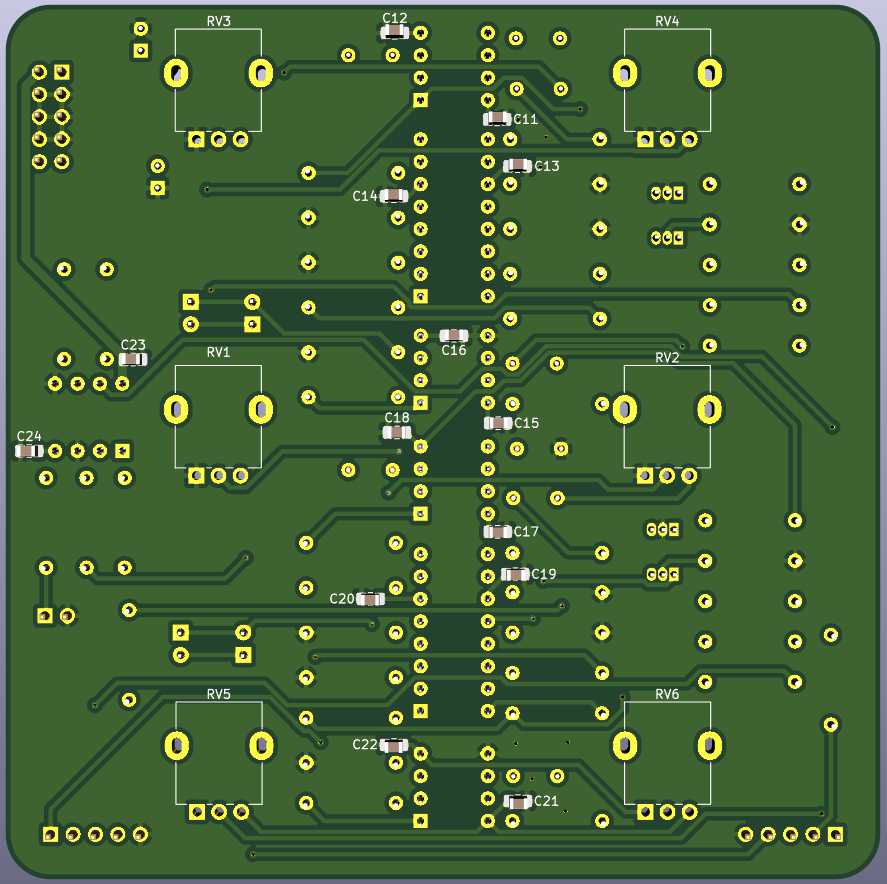

# Dual MS20 style Voltage Controlled Filter

PCB with two independendent late MS20 style VCFs, one configured as a high-pass filter and one configured as a low-pass filter.

An extra summing amplifier is provided to create a parallel HPF/LPF response. Series HPF into LPF response is easily achived with switching jack normalization.

 
