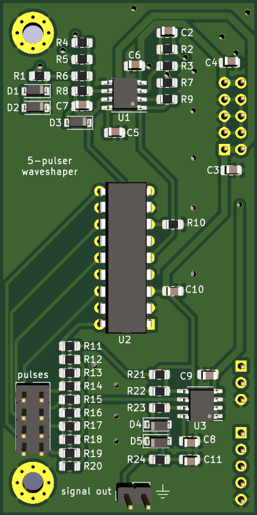
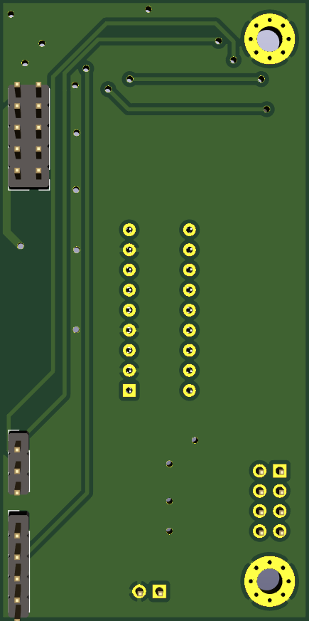

# 5-Pulser auxilliary waveshaper board

Small aux waveshaper pcb intended to be used with the oscillator carrier boards.

The 5-pulser is a unique pulse shaper that takes in sloping wave inputs and outputs a stream of between 1 and 5 pulses. The typical input is sawtooth waves.

 