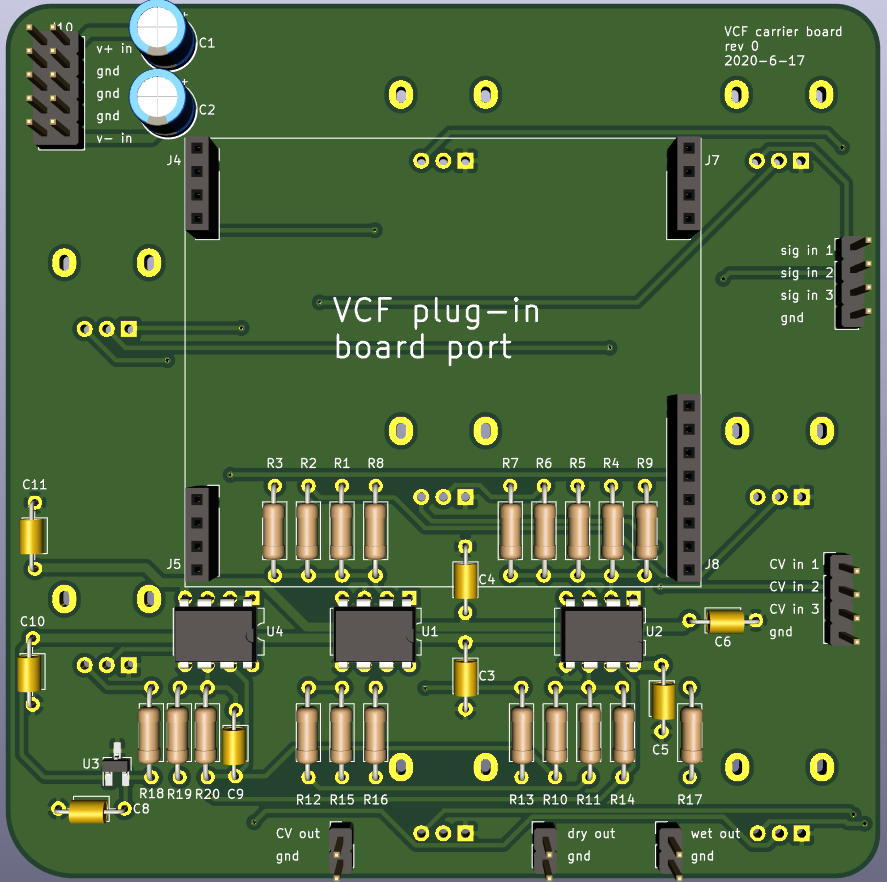
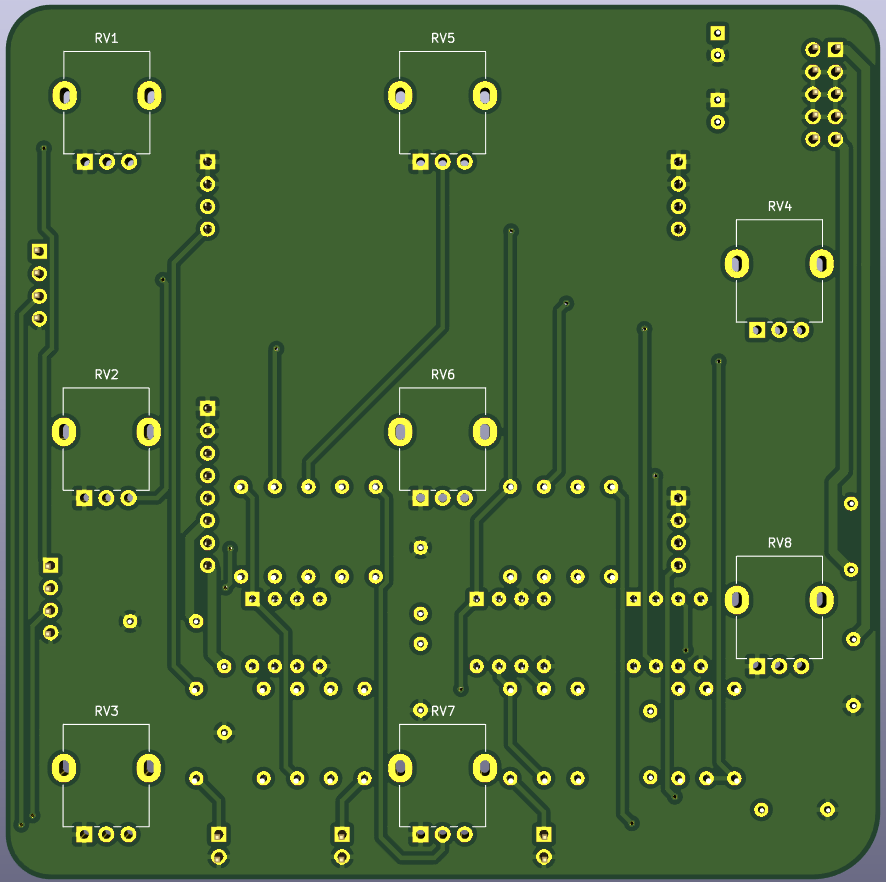

# Voltage Controlled Filter carrier board

PCB which houses various VCF "plug-in" boards. This pcb contains a 3-input signal mixer and 3-input CV mixer, as well as inputs and outputs for the plug-in board port. 

The plug-in boards must conform to the electrical and mechanical interface defined by this pcb. 

Plug-in boards must accept a CV range of 0v to +2.048v, and a feedback CV range of 0v to +2.048v.

See the CEM3320 VCF and optical phasor documents for examples of plug-in boards.

 