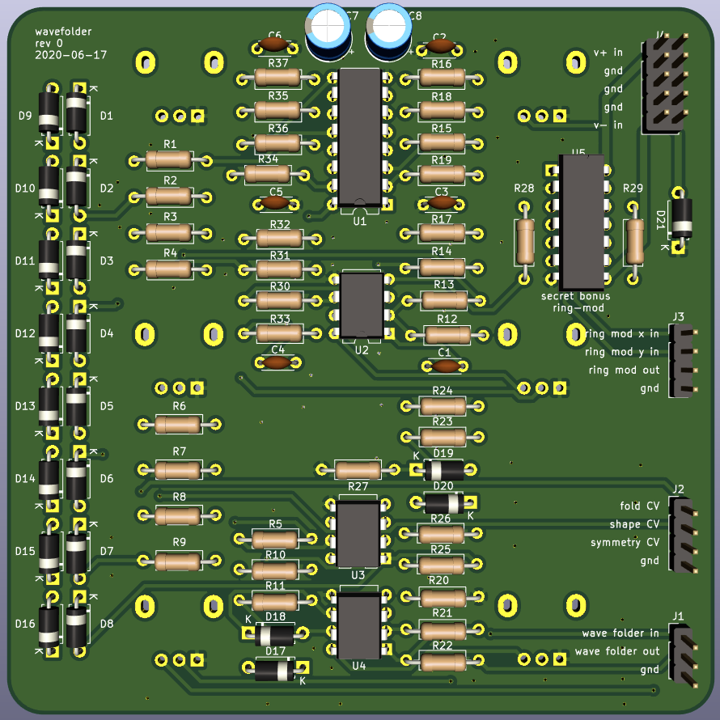
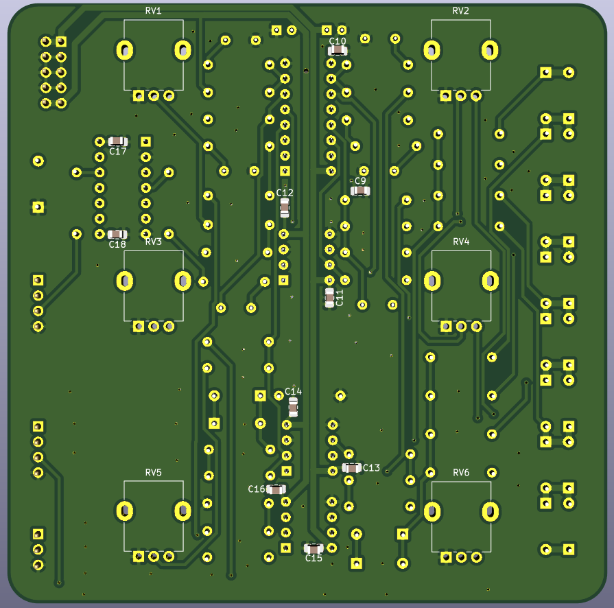

# Wavefolder

The wavefolder is a unique waveshaping circuit that creates "folded" versions of sloping input waveforms.

CV inputs for folds, shape, and offset are included.

A bonus ring-modulator circuit is included, to maintain compatability with the old module.

 